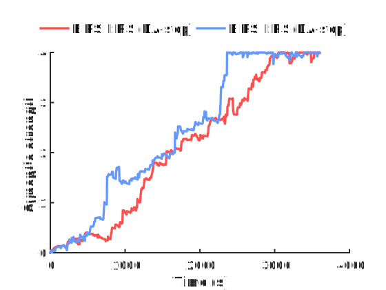
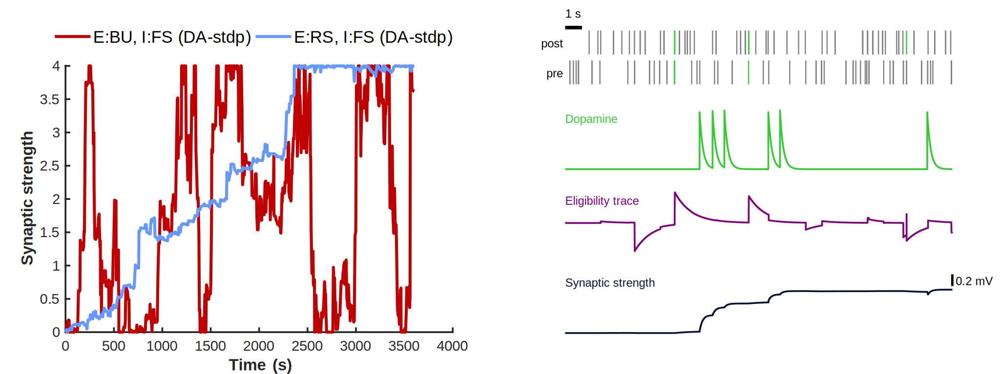

# Adaptive learning with neuromodulation-aware spiking neural networks

Simulation of a spiking neural network (SNN) with dopamine-modulated spike-timing dependent plasticity (DA-STDP). The network is designed based on Izhikevich (2007) and incorporates noradrenergic and cholinergic neuromodulation to dynamically switch the firing patterns of excitatory neurons between regular spiking and bursting modes. This modulation adds a layer of control at the neuronal level and enhancing learning.

## Key Features
- **Neuronal Populations**: The network consists of both excitatory and inhibitory neurons, each exhibiting different spiking dynamics.
- **Thalamic Input**: The network receives random thalamic input to drive spiking activity.
- **Learning Rules**: Synaptic plasticity is governed by DA-STDP.
- **Dopamine Modulation**: Dopamine levels are dynamically adjusted in response to delayed reward signals, influencing synaptic plasticity during learning.
- **NA and ACh Modulation**: Noradrenaline (NA) and acetilcholyne (ACh) act as spiking behavior switches. NA prompts flexibility in the network through bursting activity and ACh enhances stability switching to regular spiking behavior.

## Task
We demonstrate how dopamine (DA)-modulated STDP can address the credit assignment problem at the synaptic level by reinforcing the contingent firing of two neurons using delayed rewards (Izhikevich, 2007). Although the setup might seem artificial in the context of natural animal learning, it effectively illustrates the mechanism responsible for reinforcing more complex spiking patterns, as we show in subsequent examples.

In this experiment, we focus on a specific event: when a selected pair of pre- and postsynaptic neurons spike within a 20 ms time window. Each occurrence of this event, triggers a reward signal delivered to the network in the form of an extracellular DA spike. The reward is applied with a random delay ranging from 1 to 3 seconds.

Since the reward delivery is contingent on the network’s activity, this experiment can be viewed as the simplest form of instrumental conditioning. It demonstrates how the network learns to associate specific neuronal activity patterns with rewards, reinforcing the underlying spiking dynamics and paving the way for understanding the reinforcement of more sophisticated neural behaviors.

## Model
We use a spining network of 1000 izhikevich neurons with DA-STDP and delayed rewards.
### Izhikevich neurons
The Izhikevich (IZ) model is a phenomenological framework grounded in bifurcation theory, designed to simplify conductance-based models while retaining the capacity to reproduce a wide range of spiking behaviors. The model achieves this balance through a compact representation that uses only a few parameters. Its dynamics are described by two coupled differential equations:

$$
\frac{dv(t)}{dt} = 0.04 \cdot v(t)^2 + 5 \cdot v(t) + 140 - u(t) + I_\text{ext}(t),
$$
$$
\frac{du(t)}{dt} = a(t) \cdot (b(t) \cdot v(t) - u(t)).
$$

An auxiliary after-spike reset condition ensures proper spiking behavior:
$$
\text{if } v(t) \geq +30 \, \text{mV}, \quad \begin{cases} 
v(t) \leftarrow c(t), \\ 
u(t) \leftarrow u(t) + d(t),
\end{cases}
$$

where:
- $I_\text{ext}(t)$ is the external input current,
- $v(t)$ represents the membrane potential,
- $u(t)$ is the recovery variable modeling adaptation,
- $a(t), b(t), c(t), d(t)$ are parameters defining the specific firing pattern. These parameters are treated as time-dependent because neuromodulators can influence their values dynamically through their release over time.

In this model, the spike threshold is fixed at $+30 \, \text{mV}$, and the time scale is calibrated to have millisecond units. The simplicity of the IZ model allows it to simulate the firing behaviors of most cortical neuron types, including regular spiking (RS), bursting (BU), and fast spiking (FS) patterns.

### DA-STDP learning

We consider the same phenomenological model of dopamine-modulated spike-timing-dependent plasticity (DA-STDP) as proposed by Izhikevich (2007). This model integrates spike-timing-dependent plasticity (STDP), eligibility traces, and dopamine dynamics to simulate reward-modulated synaptic plasticity in neuronal networks.

The synaptic weight update is described as:

$$
\frac{dw_{ij}(t)}{dt} = \text{DA}(t) + \text{DA}_0 z_{ij}(t),
$$

where $w_{ij}(t)$ is the synaptic weight between neurons $i$ and $j$. The term $\text{DA}(t)$ represents the dopamine signal, while the second term, $\text{DA}_0 z_{ij}(t)$, introduces the influence of an eligibility trace, $z_{ij}(t)$, which acts as a memory of past activity scalated by a constant that represents the dopamine baseline $\text{DA}_0$.

The dynamics of the eligibility trace are defined by:

$
\tau_z \frac{dz_{ij}(t)}{dt} = -z_{ij}(t) + \text{STDP}(t),
$

where $\tau_z$ is the time constant governing the decay of the trace. The term $-z_{ij}(t)$ ensures a gradual decay of the eligibility trace, while $\text{STDP}(t)$ represents the contribution from spike-timing-dependent plasticity.

The STDP term is expressed as:

$$
\text{STDP}(t) = \phi_i(t) A_+ \sum_{F_j^t} e^{\frac{t-t_j^f}{\tau_+}} + \phi_j(t) A_- \sum_{F_i^t} e^{\frac{t-t_i^f}{\tau_-}},
$$

where $\phi_i(t)$ and $\phi_j(t)$ denote the spiking activity of the presynaptic and postsynaptic neurons, respectively. The constants $A_+$ and $A_-$ scale the potentiation and depression effects of STDP, with the time constants $\tau_+$ and $\tau_-$ shaping the temporal window of plasticity. The summations over $F_j^t$ and $F_i^t$ account for the timing of spikes from the presynaptic and postsynaptic neurons, i.e.:

$$
\phi_a(t) = \sum_{F_a^t} \delta \left( t-t_a^f \right)
$$

Finally, the dopamine dynamics are described as:

$$
\tau_\text{DA} \frac{d \text{DA}(t)}{dt} = -\text{DA}(t) + I_\text{DA}(t),
$$

where $\tau_\text{DA}$ is the time constant governing the decay of dopamine. The term $I_\text{DA}(t)$ represents the input of dopamine signals, often triggered by reward-related events. Essentialy,

$$
I_\text{DA}(t) = A_\text{DA} \delta \left( t-t_\text{reward} \right),
$$

which models a reward signal at a specific time $t_\text{reward}$.

## Analysis

Spiking heterogeneity and neuromodulation provide key mechanisms to fine-tune learning in SNNs. By combining diverse spiking behaviors with neuromodulatory control, these systems can achieve both fast adaptability and robust stability.

### 1. Fine-tuning through spiking heterogeneity

The diversity of spiking patterns between inhibitory and excitatory neurons plays a critical role in shaping the learning dynamics of the network. For instance, using FS neurons for inhibitory roles and RS neurons for excitatory roles enables the system to learn faster compared to a homogeneous SNN. This heterogeneity introduces complementary functionality: FS neurons provide precise temporal regulation by controlling the timing of activity, while RS neurons integrate information over longer timescales. This interplay may allow the network to converge more quickly during learning task.

Going further, we analized the BU activity in excitatory neurons. Here, the network reaches the learned state more quickly due to the higher correlation of spike timing within the reward interval. This correlated activity increases the frequency of rewards, leading to a faster enhancement of synaptic strengths. However, this rapid learning introduces instability. If synaptic traces decay (e.g., due to synaptic depression), the same mechanism that accelerates learning can also result in the network drifting away from the learned state.

To counteract this instability, one could incorporate mechanisms that dynamically adjust spiking patterns. For instance, transitioning between regular spiking and bursting activity could improve the balance between fast learning and stability. Neuromodulators, such as noradrenaline and acetylcholine, are well-suited for this purpose, as they can influence firing modes and network plasticity, providing a dynamic and adaptive solution.

### 2. Enhancing learning through neuromodulation

Neuromodulators such as DA, ACh, and NA offer powerful mechanisms to regulate both flexibility and stability during learning. **Dopamine (DA)** modulates learning by signaling rewards and driving synaptic changes through DA-STDP. The release of dopamine helps the network identify and reinforce specific patterns associated with desired behaviors, addressing the credit assignment problem. This process enables the network to prioritize certain synaptic connections, effectively encoding the learned state.

**Noradrenaline (NA)** is particularly effective during high-arousal states, where it increases network plasticity by "flattening" the energy landscape of possible states. This increased flexibility allows the network to explore various configurations rapidly and adapt to new tasks. However, heightened plasticity also introduces instability, as the system may struggle to maintain a learned state.

Once a desired state is reached, **acetylcholine (ACh)** stabilizes the network by deepening the energy state of the learned configuration, effectively consolidating the behavior. This consolidation reduces variability in neuronal activity, ensuring that the network maintains robustness over time. The sequential interplay of NA and ACh thus mirrors biological learning processes: NA promotes exploration and flexibility, while ACh ensures stability and retention of learned states.

In biological terms, this mechanism aligns with how high arousal triggers rapid learning through NA release, followed by cholinergic modulation that consolidates learning into a stable memory. By combining these neuromodulatory effects with spiking heterogeneity, SNNs can achieve a balance between adaptability and stability, mimicking the flexibility and efficiency of biological neural systems.

# Citation
This work has been presented at the SNUFA Conference 2024 (Youtube: [SNUFA 2024 Flash Talks](https://www.youtube.com/watch?v=o6kT44elYNk&t=10s)).

Rodriguez-Garcia A, Ramaswamy S (2024). *Adaptive learning with neuromodulation-aware spiking neural networks*. SNUFA Conference 2024. 

